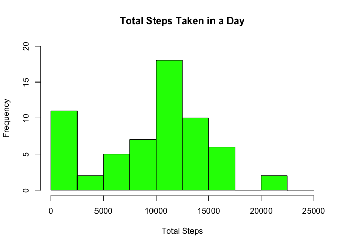
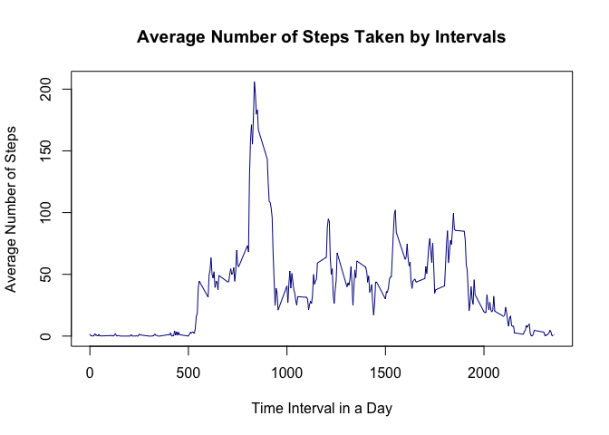
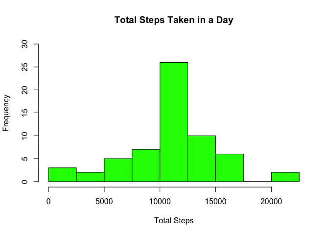
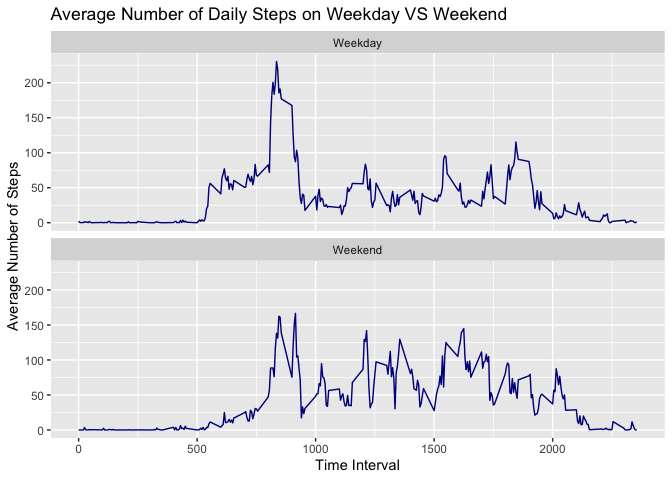

## 1. Loading and preprocessing the data  

### 1.1 Loading the data
Since we are given a zip file for the data, we must unzip the file first.

```r
unzip("activity.zip")
```
  
The file has the extension *.csv*, so it can be read into R using *read.csv* function.

```r
data <- read.csv("activity.csv", header = TRUE, na.strings = "NA")
```
  
### 1.2 Preprocessing and reformatting the data
I have reformatted the data a bit so that the *interval* becomes the first column and the *steps* column becomes the last.

```r
dataSteps <- data[,1]
dataIntervals <- data[,3]
data[,1] <- dataIntervals
data[,3] <- dataSteps
names(data) <- c("interval", "date", "steps")
```
  
Also, from the *str* function, the *date* column is a character string. Thus, I have converted it into a date format.

```r
data[,2] <- as.Date(data[,2], format = "%Y-%m-%d")
```
  
Before we moved on, let's preview the data

```r
str(data)
```

```
## 'data.frame':	17568 obs. of  3 variables:
##  $ interval: int  0 5 10 15 20 25 30 35 40 45 ...
##  $ date    : Date, format: "2012-10-01" "2012-10-01" ...
##  $ steps   : int  NA NA NA NA NA NA NA NA NA NA ...
```
  
  
  
## 2. What is mean total number of steps taken per day?
  
**Note that in this part, all of the missing values in the *steps* column is ignored.**
  
### 2.1 Calculate the total number of steps taken per day
First we need to group the data according to the date, then sum all of the steps together. Since some of the data are missing, for those days where all of the data are missing, the *totalSteps* will be zero.

```r
library(dplyr)
totalSteps <- data %>% group_by(date) %>% summarize(total = sum(steps, na.rm = TRUE))
```
  
### 2.2 Make a histogram of the total number of steps taken each day
In this part, I will use the base plotting system to plot the histogram. 

```r
hist(totalSteps$total, breaks = seq(0, 25000, by = 2500), col = "green", main = "Total Steps Taken in a Day", xlab = "Total Steps", ylim = c(0,20))
```

<!-- -->
  
### 2.3 Calculate and report the mean and median of the total number of steps taken per day
In this part, I will calculate both the mean and median of the total number of steps each day, before reporting in a single statement.

```r
# Insert the argument na.rm = TRUE just to ensure no NA values
meanSteps <- with(totalSteps, mean(total, na.rm = TRUE))
medianSteps <- with(totalSteps, median(total, na.rm = TRUE))
```
  
In conclusion, the **mean** number of steps taken each day is **9354.2295082** and the **median** number of steps taken each day is **10395**.
  
  
  
## 3. What is the average daily activity pattern?
  
**Note that in this part, all of the missing values in the *steps* column is ignored.**
  
### 3.1 Make a time series plot of the 5-minute interval and the average number of steps taken, averaged across all days
Similar to the histogram, we will need to group the data according to the *interval* first. Then calculate the mean steps taken for each interval and plot a time-series graph.

```r
by_interval <- data %>% group_by(interval) %>% summarize(mean = mean(steps, na.rm = TRUE))
with(by_interval, plot(interval, mean, type = "l", col = "darkblue", xlab = "Time Interval in a Day", ylab = "Average Number of Steps", main = "Average Number of Steps Taken by Intervals"))
```

<!-- -->
  
### 3.2 Which 5-minute interval, on average across all the days in the dataset, contains the maximum number of steps?
In this part, we will use the *which.max* function to determine the row which the corresponding interval has the highest average number of steps. Subset out the interval. Then, it will be reported in a statement.

```r
maxRow <- with(by_interval, which(mean == max(mean)))
maxInterval <- by_interval[maxRow, ][1]
```
  
Thus, the interval for which there is the highest average number of steps is **835**.
  
  
  
## 4. Imputing missing values
  
### 4.1 Calculate and report the total number of missing values in the dataset
We will use the *is.na* function to determine which rows contain NA for the steps value. Then, we will sum it to calculate the number of rows with missing values before reporting it in a statement.

```r
missingValues <- with(data, sum(is.na(steps)))
```
  
As a result of the code above, there are **2304** missing values in the data set.
  
### 4.2 Devise a strategy for filling in all of the missing values in the dataset.
The strategy is that the missing value in a given time interval will be imputed by the mean of all other values in that 5-minute interval. First, merged the original *data* set and the *by_interval* together and fill in the missing values with the corresponding mean values.

```r
# The mean of each 5-minute interval is stored in the 'by_interval' variable
mergedData <- merge(data, by_interval, by = "interval")
for (i in 1:nrow(mergedData)) {
    if (is.na(mergedData$steps[i]) == TRUE) {
        mergedData$steps[i] <- mergedData$mean[i]
    }
}
```
  
### 4.3 Create a new dataset that is equal to the original dataset but with the missing data filled in.
The no-missing values data set will be called *data1*. It is the re-ordering of the *mergedData* data set by *date* and *interval*, respectively.

```r
data1 <- with(mergedData, mergedData[order(date, interval),])
```
  
### 4.4 Make a histogram of the total number of steps taken each day
This is achieved similarly to the first histogram. First, aggregate the total steps taken each day and plot a histogram.

```r
new_totalSteps <- data1 %>% group_by(date) %>% summarize(sum = sum(steps))
hist(new_totalSteps$sum, breaks = seq(1, 25000, by = 2500), col = "green", xlab = "Total Steps", main = "Total Steps Taken in a Day", ylim = c(0,30))
```

<!-- -->
  
### 4.5 Calculate and report the mean and median total number of steps taken per day.
Again, similar to the very first part of the analysis. Using the *mean* and *median* functions to calculate the values and report it in the following statements.

```r
new_meanSteps <- mean(new_totalSteps$sum)
```
  
The average total number of steps taken per day after dealing with the NAs is **1.0766189\times 10^{4}**
  

```r
new_medianSteps <- median(new_totalSteps$sum)
```
And the median value for the total number of steps taken per day after missing values are imputed is **1.0766189\times 10^{4}**.
  
### 4.6 Comment on the results:
It appears that both the mean and median values after imputing the NAs are higher than before. 
  
  
  
## 5. Are there differences in activity patterns between weekdays and weekends?
    
**Note that this part uses the data with imputed missing values.**
    
### 5.1 Create a new factor variable in the dataset with two levels – “weekday” and “weekend” indicating whether a given date is a weekday or weekend day.
First off, add the *day* column to the *data1* data frame. Then, we will use the *weekdays* function to determine whether a given day is **weekday** or **weekend** and create a factor variable called *day*.

```r
data1$day <- weekdays(data1$date)
for (i in 1:nrow(data1)) {
    if (data1$day[i] == "Saturday" | data1$day[i] == "Sunday") {
        data1$day[i] <- "Weekend"
    }
    else {data1$day[i] <- "Weekday"}
}
data1$day <- as.factor(data1$day)
```
  
### 5.2 Make a panel plot containing a time series plot of the 5-minute interval and the average number of steps taken, averaged across all weekday days or weekend days.
First we need to calculate the average number of steps taken in each time interval, separating *weekday* and *weekend*, using the *aggregate* function.

```r
by_day <- aggregate(steps ~ day + interval, data1, mean)
```
  
Next, I will use the *ggplot2* package to generate the panel plot via the *ggplot* function.

```r
library(ggplot2)
g <- ggplot(by_day, aes(interval, steps))
g + geom_line(color = "darkblue") + facet_wrap(day ~ ., nrow = 2, ncol = 1) + labs(x = "Time Interval", y = "Average Number of Steps", title = "Average Number of Daily Steps on Weekday VS Weekend")
```

<!-- -->
  


